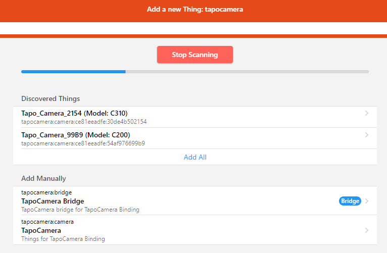
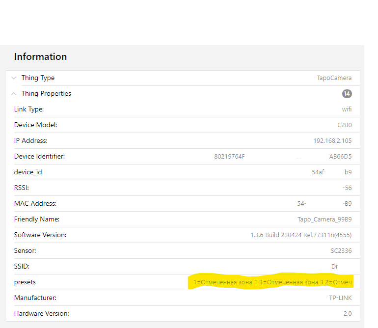
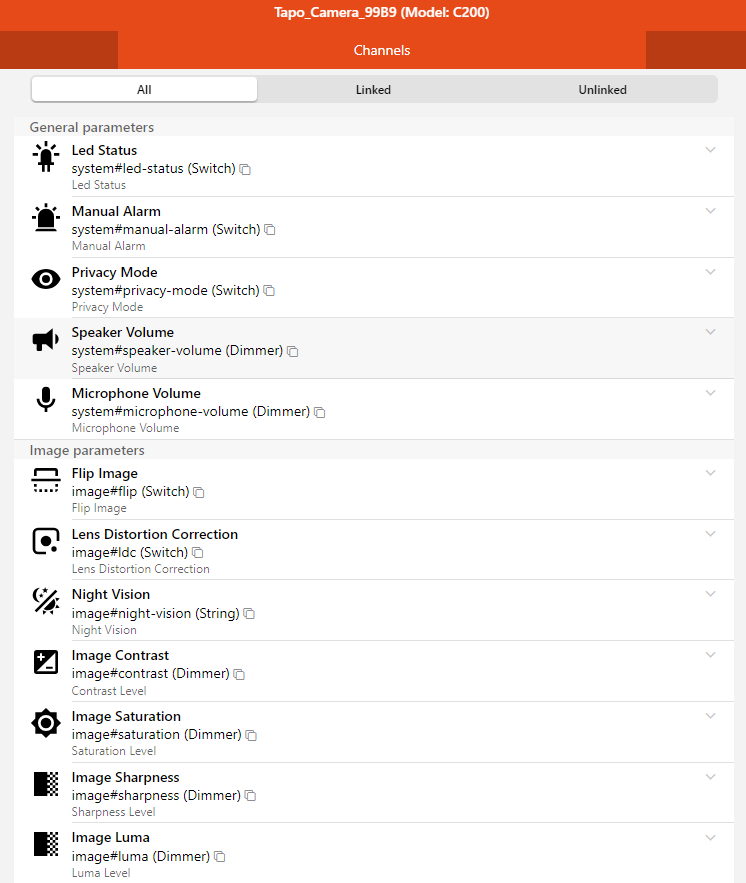
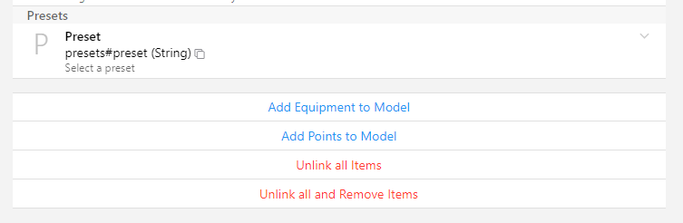

# TapoCamera Binding

The binding allows you to control Tapo Camera settings and manually turn on/off siren.

At the moment not all functions are supported.

The binding not repeat an IP Camera binding functionality.

My main goal was to get manual control of the siren (like HomeAssistant do) in automations.

Tested on Tapo C200 and C310.

The Binding uses local API. More info is here https://md.depau.eu/s/r1Ys_oWoP#Tapo-C200

## Supported Things

First, you should create a bridge with cloud username (email) and password.

Then you can use discovery or manual add a camera.

## Discovery

Discovery uses cloud api to get information about available cameras from your Tapo account (Mobile App).

This information doesn't have information about camera IP address that needed to connect ot camera.

On Linux the discovery uses an arp-table to get camera IP address automatically.

## Thing Configuration

To connect the camera you should fill requirement fields:

- `Hostname` - camera IP address
- `Username` - for C200 and C310 and may be other, you should put `admin` username, in other case - camera username created in `Mobile App -> Additional Setting -> Camera account`
- `Password` - password created in `Mobile App -> Additional Setting -> Camera account`
- `Cloud password` - password for your cloud account (the same is in Bridge), uses to access via local api

After connecting to the camera some information will available:

## Channels

At the moment list of channels contains all channels even if channel not available on specific camera model.

For example, C310 doesn't have motor (PTZ), but channel Preset is shown.
C200 doesn't have line-crossing and intrusion detections, but these channels will be shown.

For example:

- `Manual Alarm` - send ON/OFF to item to turn on/off siren
- `Preset` - for camera with motor you can send command with preset id to move camera to target position.
   
   You can find available preset id and name in Thing Info (see above picture with yellow selection).
   
   Just copy that text and put it to the state description of item to control preset from UI or use preset id to control from automation.

## Thank you

- Juraj Nyíri - PyTapo - https://github.com/JurajNyiri/pytapo
- Davide Depau - https://md.depau.eu/s/r1Ys_oWoP

## Disclaimer

Author does not guarantee functionality of this binding and is not responsible for any damage.

All product names, trademarks and registered trademarks in this repository, are property of their respective owners.
